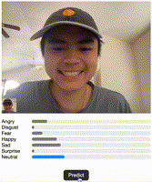

# Facial Expressions

Analyze your facial expressions with ✨Machine Learning✨. Uses a modified version of AlexNet and achieves a (pretty crap) accuracy of ~50% on 7 classes.

Includes the model weights and a simple FastAPI webapp for inference.



## Development

```bash
uv run fastapi dev
```
